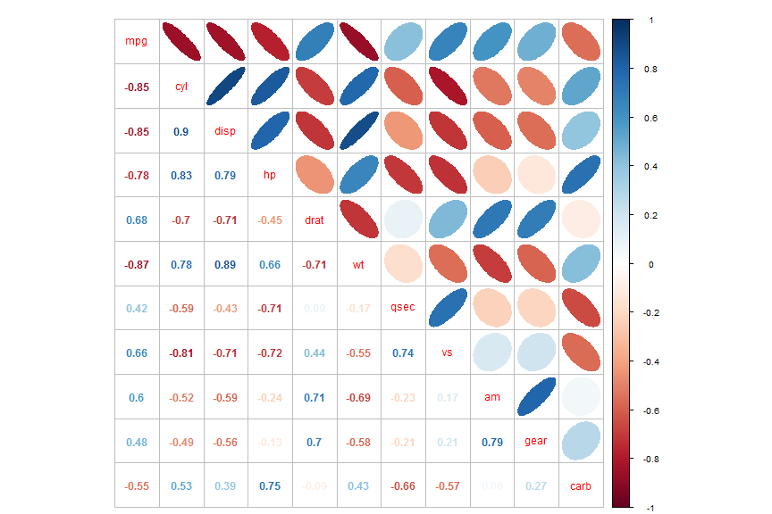
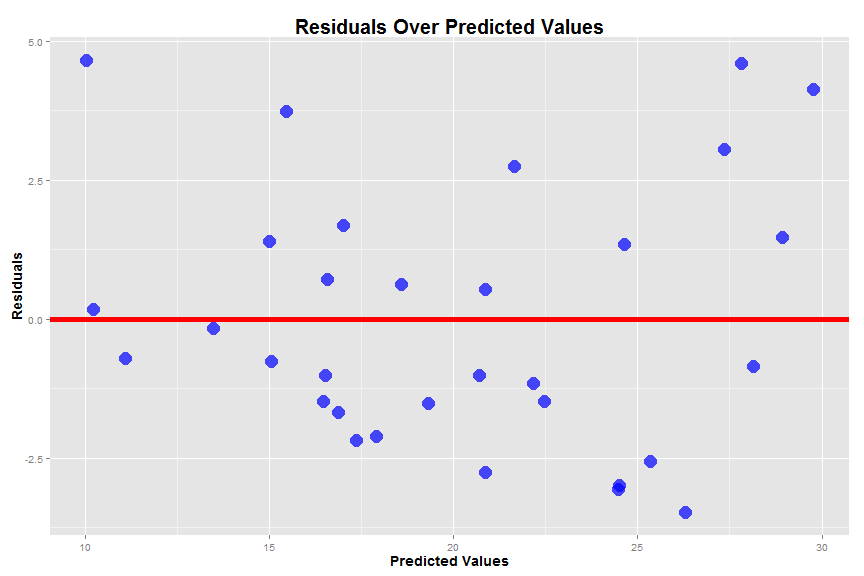
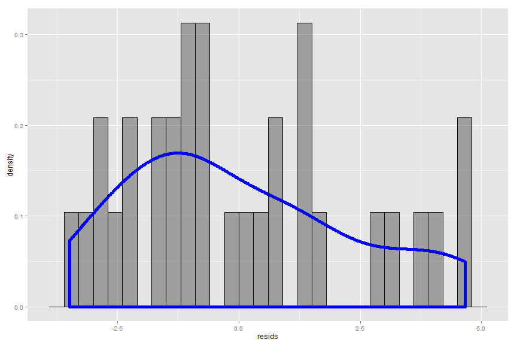
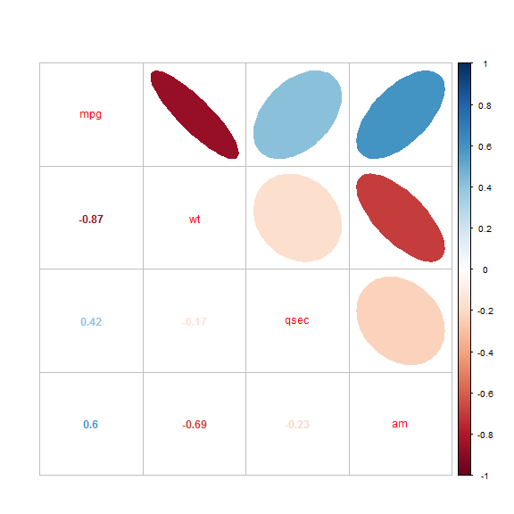
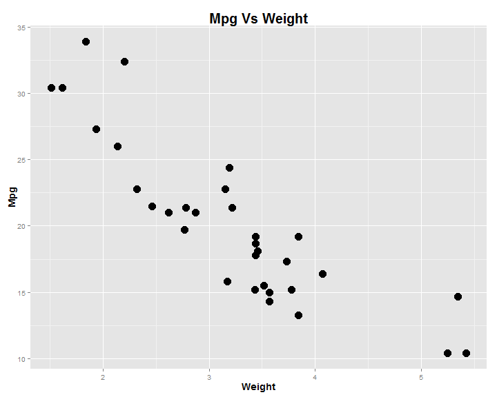
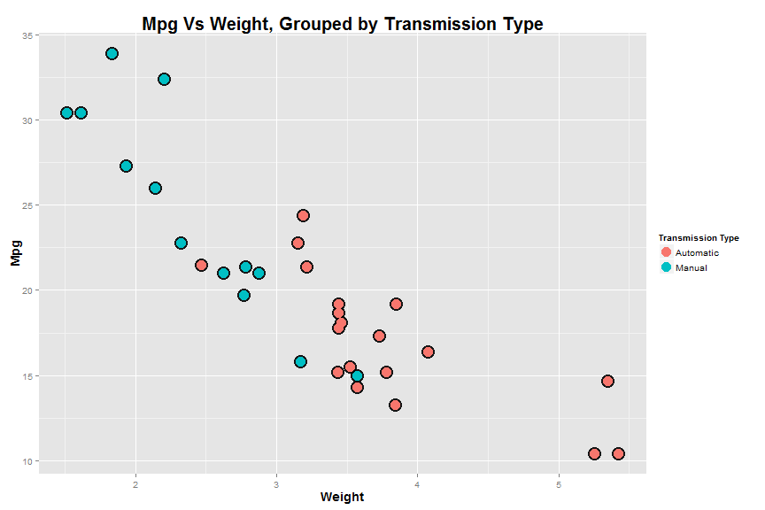
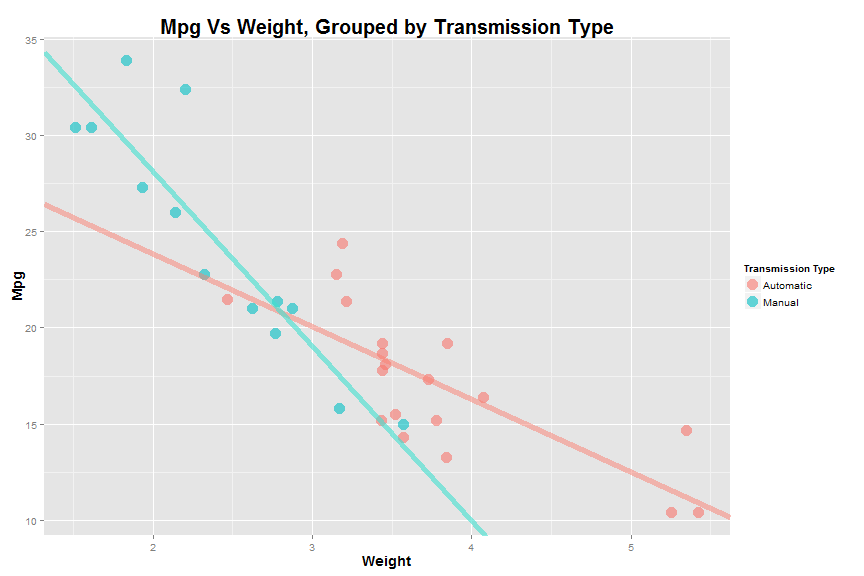
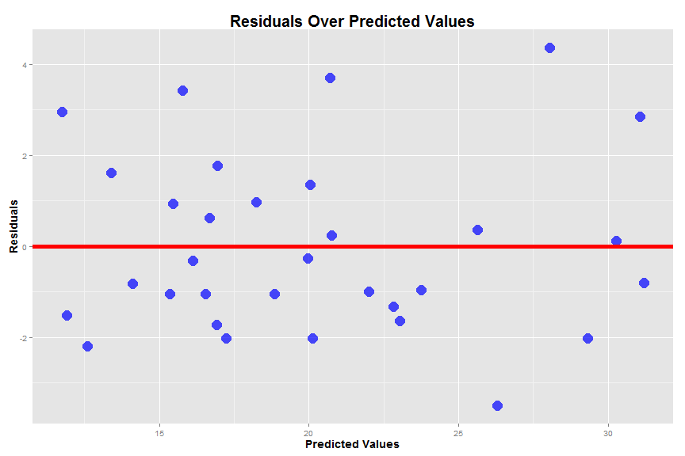
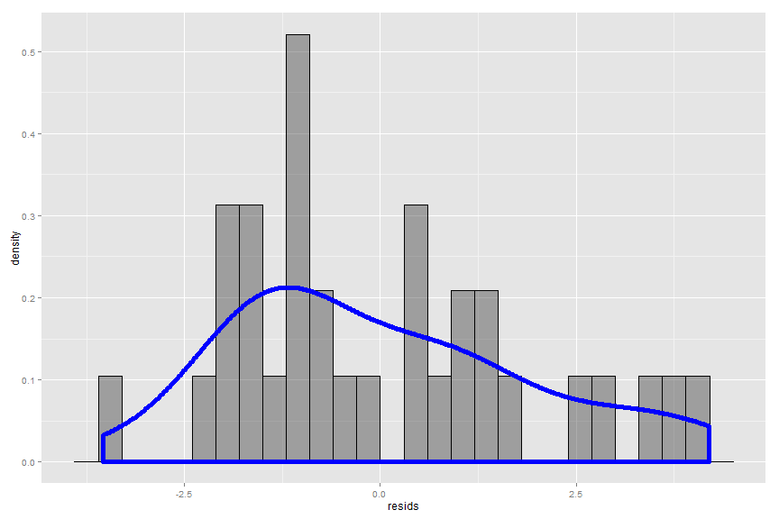
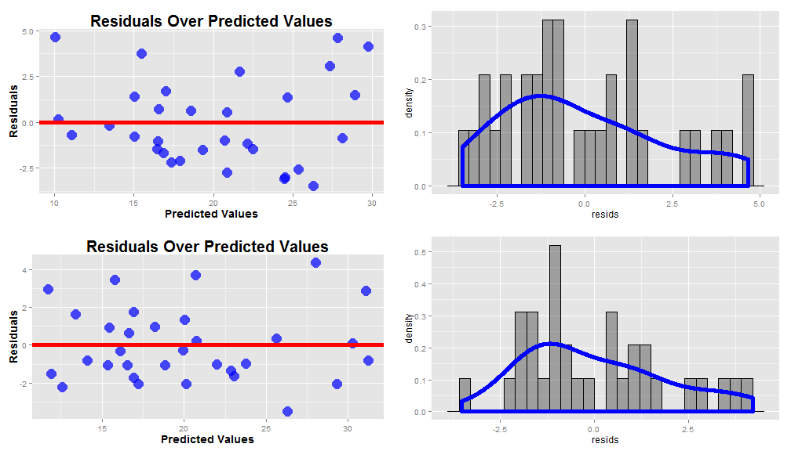

---
title       : Tweaking Linear Regression Models
subtitle    : An Introduction
author      : Alexander Hegeman
job         : 
framework   : io2012        # {io2012, html5slides, shower, dzslides, ...}
highlighter : highlight.js  # {highlight.js, prettify, highlight}
hitheme     : tomorrow      # 
widgets     : [mathjax]            # {mathjax, quiz, bootstrap}
mode        : selfcontained # {standalone, draft}
knit        : slidify::knit2slides
--- bg:#BCC6CC

## Overview

* Build a linear regression model


* Investigate ways to improve our model
    + Look at interaction variables


* Evaluate our models
    + Explore Diagnostics


* Interpret our models


--- bg:#BCC6CC

## Intended Audience

* Undergraduate students


* Beginners in data analysis


* Interested hobbyists


--- bg:#BCC6CC


## Our Data

Data is from the <span style="color:blue; font-weight:bold">1974 Motor Trend US magazine</span>


```r
data(mtcars)
head(mtcars)
```

```
##                    mpg cyl disp  hp drat    wt  qsec vs am gear carb
## Mazda RX4         21.0   6  160 110 3.90 2.620 16.46  0  1    4    4
## Mazda RX4 Wag     21.0   6  160 110 3.90 2.875 17.02  0  1    4    4
## Datsun 710        22.8   4  108  93 3.85 2.320 18.61  1  1    4    1
## Hornet 4 Drive    21.4   6  258 110 3.08 3.215 19.44  1  0    3    1
## Hornet Sportabout 18.7   8  360 175 3.15 3.440 17.02  0  0    3    2
## Valiant           18.1   6  225 105 2.76 3.460 20.22  1  0    3    1
```

--- bg:#BCC6CC

## Motivating Thoughts

1. What is the question we would like to answer?

2. How are we going to answer this question?

3. What do the data look like?

4. How are we going to evaluate our solution?

5. Are there interesting relationships in our data?


--- bg:#BCC6CC

We will use $R^2$ to evaluate our models.

$R^2$ is the percentage of variance of the response variable explained by the model

Higher $R^2$ is better*

Other options:

* RMSE
* Accuracy
* AUC

Occam's Razor

--- bg:#BCC6CC

### Correlation Between All Varibles




--- bg:#BCC6CC

## First Model


```r
fit_all <- lm(mpg ~ ., data = mtcars)
summary(fit_all)$coefficients
```

```
##                Estimate  Std. Error    t value   Pr(>|t|)
## (Intercept) 12.30337416 18.71788443  0.6573058 0.51812440
## cyl         -0.11144048  1.04502336 -0.1066392 0.91608738
## disp         0.01333524  0.01785750  0.7467585 0.46348865
## hp          -0.02148212  0.02176858 -0.9868407 0.33495531
## drat         0.78711097  1.63537307  0.4813036 0.63527790
## wt          -3.71530393  1.89441430 -1.9611887 0.06325215
## qsec         0.82104075  0.73084480  1.1234133 0.27394127
## vs           0.31776281  2.10450861  0.1509915 0.88142347
## am           2.52022689  2.05665055  1.2254035 0.23398971
## gear         0.65541302  1.49325996  0.4389142 0.66520643
## carb        -0.19941925  0.82875250 -0.2406258 0.81217871
```

--- bg:#BCC6CC

## p-values

Let $\beta_i$ be the true coefficient of our $i^{th}$ independent variable.

Then our **p-values** represnt the probability of obtaining our coefficient estimate, $\hat \beta_i$, given the null hypothesis $H_0: \beta_i = 0$

Common significance cutoff value is $p = 0.05$

--- bg:#BCC6CC

## Feature Selection

* Identify variable with highest p-value

* Fit new regression model excluding this variable

* Repeat process until all independent variables are significant

--- bg:#BCC6CC


```r
fit_minus_one <- lm(mpg ~ .-cyl, data = mtcars)
summary(fit_minus_one)$coefficients
```

```
##                Estimate  Std. Error    t value   Pr(>|t|)
## (Intercept) 10.96007405 13.53030251  0.8100391 0.42659327
## disp         0.01282839  0.01682215  0.7625891 0.45380797
## hp          -0.02190885  0.02091131 -1.0477031 0.30615002
## drat         0.83519652  1.53625251  0.5436584 0.59214373
## wt          -3.69250814  1.83953550 -2.0073046 0.05715727
## qsec         0.84244138  0.68678068  1.2266527 0.23291993
## vs           0.38974986  1.94800204  0.2000767 0.84325850
## am           2.57742789  1.94034563  1.3283344 0.19768373
## gear         0.71155439  1.36561933  0.5210489 0.60753821
## carb        -0.21958316  0.78855537 -0.2784626 0.78325783
```


--- bg:#BCC6CC


```r
fit_minus_two <- lm(mpg ~ .-cyl -vs, data = mtcars)
summary(fit_minus_two)$coefficients
```

```
##                Estimate  Std. Error    t value   Pr(>|t|)
## (Intercept)  9.76827789 11.89230469  0.8213949 0.41985460
## disp         0.01214441  0.01612373  0.7532010 0.45897019
## hp          -0.02095020  0.01992567 -1.0514175 0.30398892
## drat         0.87509822  1.49112525  0.5868710 0.56300717
## wt          -3.71151106  1.79833544 -2.0638592 0.05049085
## qsec         0.91082822  0.58311935  1.5619928 0.13194532
## am           2.52390094  1.88128007  1.3415870 0.19282690
## gear         0.75984464  1.31577205  0.5774896 0.56921947
## carb        -0.24796312  0.75933250 -0.3265541 0.74695821
```

--- bg:#BCC6CC


```r
fit_minus_three <- lm(mpg ~ . -cyl -vs -carb, data = mtcars)
summary(fit_minus_three)
```

```
## 
## Call:
## lm(formula = mpg ~ . - cyl - vs - carb, data = mtcars)
## 
## Residuals:
##     Min      1Q  Median      3Q     Max 
## -3.1200 -1.7753 -0.1446  1.0903  4.7172 
## 
## Coefficients:
##             Estimate Std. Error t value Pr(>|t|)   
## (Intercept)  9.19763   11.54220   0.797  0.43334   
## disp         0.01552    0.01214   1.278  0.21342   
## hp          -0.02471    0.01596  -1.548  0.13476   
## drat         0.81023    1.45007   0.559  0.58151   
## wt          -4.13065    1.23593  -3.342  0.00272 **
## qsec         1.00979    0.48883   2.066  0.04981 * 
## am           2.58980    1.83528   1.411  0.17104   
## gear         0.60644    1.20596   0.503  0.61964   
## ---
## Signif. codes:  0 '***' 0.001 '**' 0.01 '*' 0.05 '.' 0.1 ' ' 1
## 
## Residual standard error: 2.488 on 24 degrees of freedom
## Multiple R-squared:  0.8681,	Adjusted R-squared:  0.8296 
## F-statistic: 22.56 on 7 and 24 DF,  p-value: 4.218e-09
```


--- bg:#BCC6CC


```r
fit_sig <- lm(mpg ~ wt + qsec + am, data = mtcars)
summary(fit_sig)
```

```
## 
## Call:
## lm(formula = mpg ~ wt + qsec + am, data = mtcars)
## 
## Residuals:
##     Min      1Q  Median      3Q     Max 
## -3.4811 -1.5555 -0.7257  1.4110  4.6610 
## 
## Coefficients:
##             Estimate Std. Error t value Pr(>|t|)    
## (Intercept)   9.6178     6.9596   1.382 0.177915    
## wt           -3.9165     0.7112  -5.507 6.95e-06 ***
## qsec          1.2259     0.2887   4.247 0.000216 ***
## am            2.9358     1.4109   2.081 0.046716 *  
## ---
## Signif. codes:  0 '***' 0.001 '**' 0.01 '*' 0.05 '.' 0.1 ' ' 1
## 
## Residual standard error: 2.459 on 28 degrees of freedom
## Multiple R-squared:  0.8497,	Adjusted R-squared:  0.8336 
## F-statistic: 52.75 on 3 and 28 DF,  p-value: 1.21e-11
```

--- bg:#BCC6CC

## Evaluation of base model


```r
summary(fit_all)$adj.r.squared
```

```
## [1] 0.8066423
```


```r
summary(fit_sig)$adj.r.squared
```

```
## [1] 0.8335561
```

--- bg:#BCC6CC

 

--- bg:#BCC6CC


## Residuals

$$\hat Y_i = \hat \beta_0 + \hat \beta_1X_1 + \hat \beta_2X_2 + \epsilon_i$$

* We want our residuals to follow a normal distribution

* Some sort of pattern in the residual plot usually points to variance in our depedent variable we have not accounted for
    + missing terms in model

* We are looking for homoscedascisity, or constant variance

--- bg:#BCC6CC

## Histogram of Residuals

 


--- bg:#BCC6CC

## Correlation of Significant Variables



--- bg:#BCC6CC

## Fitting Model with Interactions


```r
fit_int <- lm(mpg ~ wt*qsec + wt*am + qsec*am, data = mtcars)
summary(fit_int)$coefficients
```

```
##                Estimate Std. Error    t value    Pr(>|t|)
## (Intercept) -31.8598140 33.5894244 -0.9485073 0.351950704
## wt            9.8361860  9.8094164  1.0027290 0.325598997
## qsec          3.3187634  1.8349518  1.8086379 0.082551306
## am           21.7150538 15.8498376  1.3700490 0.182851089
## wt:qsec      -0.7113650  0.5424688 -1.3113474 0.201657327
## wt:am        -4.7165458  1.6643036 -2.8339456 0.008964866
## qsec:am      -0.3536353  0.7094109 -0.4984915 0.622495265
```

--- bg:#BCC6CC


```r
fit_int <- lm(mpg ~ wt + qsec + am + wt:am, data = mtcars)
summary(fit_int)$coefficients
```

```
##              Estimate Std. Error   t value     Pr(>|t|)
## (Intercept)  9.723053  5.8990407  1.648243 0.1108925394
## wt          -2.936531  0.6660253 -4.409038 0.0001488947
## qsec         1.016974  0.2520152  4.035366 0.0004030165
## am          14.079428  3.4352512  4.098515 0.0003408693
## wt:am       -4.141376  1.1968119 -3.460340 0.0018085763
```

```r
summary(fit_int)$adj.r.squared
```

```
## [1] 0.8804219
```

--- bg:#BCC6CC



--- bg:#BCC6CC



--- bg:#BCC6CC



--- bg:#BCC6CC

 

--- bg:#BCC6CC

## Histogram of Residuals of New Model
 

--- bg:#BCC6CC

 

--- bg:#BCC6CC

## Is It Worth It???

### Things to consider:

* Who is the end user of your analysis?

* What is the intended application of your analysis?

*"In modeling, our interest lies in parsimonious, interpretable representations of the data that enhance our understanding of the phenomena under study"*

-Brian Caffo/Jeff Leek/Roger Peng

--- bg:#BCC6CC

## Wrap Up

1. Regression analysis is difficult!
  + Keep interactions in mind
  + Visualize your data
  + Be mindful of application/end user
  + Diagnostics are important

2. Regression analysis is fun!
  + Always something new to uncover
  + Many, many techniques to discover and attemp
  
